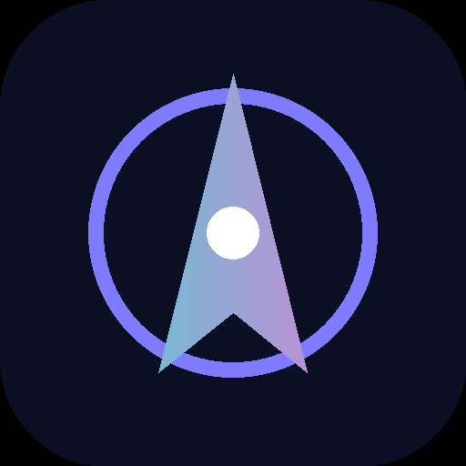

<div align="center">



# 🧭 AIRREM 领航

### 科学上网机场评测 · 选购导航

**把「机场怎么选、怎么避坑」讲明白 —— 38 家机场逐条实测，帮你自己做决定，而不是被返佣榜单牵着走**

<br>

[](https://air-rem.github.io/)
[](https://air-rem.github.io/airports/)
[](https://guide.rtxk.us/)


</div>

---

<div align="center">

## 🦁 Leonis AI · 一个端点，抵达所有模型

[](https://i.rtxk.us/i/r37kbkg)
[](https://guide.rtxk.us/tutorial/ai-coding/leonis-ai-cc-switch-guide.html)


</div>

> **机场负责连上，AI 负责干活。**
> 节点买好了，Claude Code、Codex、Cherry Studio 之间却还在反复改环境变量、换 Base URL、粘不同的密钥？
> **Leonis AI** 把各家大模型的订阅额度，统一成同一个 API 端点 —— **不改代码、不换客户端，只替换一行 Base URL**。

| | 卖点 | 说明 |
|:---:|---|---|
| 🔌 | **原生工具直连** | 官方 CLI 直接用，不需要额外插件或魔改 |
| 🌊 | **全程流式不缓冲** | 长回答边生成边吐字，不会卡到最后一次性蹦出来 |
| ♻️ | **多账号池调度** | 后端多号轮询，单号被限流时自动顶上，稳定性更好 |
| 🔑 | **一个密钥全模型** | Claude、GPT、Gemini 共用一把 `sk-` 密钥，省心 |

支持 **Claude、GPT、Gemini、Grok、Antigravity 等 6+ 模型**；客户端覆盖 **Claude Code / Codex CLI / Cherry Studio / NextChat / OpenAI SDK**。
接入就是三行：

```bash
export ANTHROPIC_BASE_URL=https://ai.svtun.cn
export ANTHROPIC_AUTH_TOKEN=sk-你的密钥
claude
```

> Base URL 填上面这个端点即可：Claude Code 用法是**结尾不带斜杠、不带 `/v1`**；OpenAI 兼容客户端则在同一端点后面加 `/v1`。
> 也支持 **cc-switch** 桌面工具「导入到 CCS」一键导入供应商配置。

邮箱注册，几十秒完成，**注册即送体验额度**。

<div align="center">

**[🦁 Leonis AI · 免费注册领体验额度 →](https://i.rtxk.us/i/r37kbkg)** · **[📖 cc-switch 接入教程 →](https://guide.rtxk.us/tutorial/ai-coding/leonis-ai-cc-switch-guide.html)**

<sub>机场解决「连得上」，Leonis AI 解决「用得顺」—— 两件事互补，不是替代。</sub>

</div>

---

> **AIRREM 领航** 是一个**第三方机场评测与选购导航**平台。我们不做又一份「返佣排序榜单」，而是把**判断一家机场值不值、怎么识别假专线与虚标带宽、怎么按场景选**的方法开源出来 —— 让你在 38 家科学上网机场里**自己做决定**。

## 🧭 我们做什么

搜「机场推荐」你会刷到无数张 TOP 榜，但它们大多是**返佣排序**，换个站又是另一套名次。AIRREM 反过来做：**先给判断方法与避坑清单，再给精选与对比**。逐条实测线路真假、带宽虚实、晚高峰稳定性与跑路信号，把选购这件事变成**有标准、可复用、少踩坑**。

## ✨ 你能在这里得到什么

| | 内容 | 说明 |
|:---:|---|---|
| 🎯 | **30 秒场景决策** | 对号入座 —— 性价比 / 专线 / 追剧 / AI / 大流量，直达对应机场评测 |
| 🔬 | **评测方法论** | 5 条固定动作：辨线路真假、验带宽虚标、测解锁真实、识跑路信号、看稳定性 |
| 🛡️ | **避坑清单** | 月付试水、备用容灾、协议对客户端、优惠码以官网为准，新手必读 |
| 🎬 | **Emby 影音专题** | 内置 / 赠送私人影视库的机场清单，装客户端登录即看 |
| 🤖 | **AI 优化机场** | 稳定连 ChatGPT / Claude / Gemini 不报错、少风控的机场甄选 |
| 🛰️ | **IEPL / IPLC 专线** | 晚高峰追剧、跨境办公、游戏低延迟首选，认准真专线 |

## 🔗 快速链接

| 入口 | 地址 |
|---|---|
| 🌐 机场推荐站 | **<https://air-rem.github.io/>** |
| 📚 机场大全（38 家逐条评测） | **<https://air-rem.github.io/airports/>** |
| 🧭 怎么选 · 评测方法论（本仓库） | **[air-rem/air-rem.github.io](https://github.com/air-rem/air-rem.github.io)** |
| 📝 花渡攻略博客（教程避坑） | **<https://guide.rtxk.us/>** |
| 🤖 AI 订阅指南（成品号） | **<https://555735.xyz/>** |
| 🦁 Leonis AI 中转站（一个端点抵达所有模型） | **[Leonis AI · 免费注册领体验额度 →](https://i.rtxk.us/i/r37kbkg)** |
| 📖 Leonis AI · cc-switch 接入教程 | **[guide.rtxk.us/tutorial/ai-coding](https://guide.rtxk.us/tutorial/ai-coding/leonis-ai-cc-switch-guide.html)** |

## 💡 适合你，如果……

- 想找**稳定、性价比高**的机场，但被满屏返佣榜单搞晕
- 分不清**真 IEPL 专线**和「套壳中转」，怕买到晚高峰就卡的
- 追剧要 **Netflix / Disney+ / Emby** 全解锁，又想省钱
- 重度用 **AI（ChatGPT / Claude / Gemini）**，需要 IP 干净不封号的线路

---

<div align="center">

### 选机场，先看方法，再看榜单

**[进入机场推荐站 →](https://air-rem.github.io/)** · **[看 38 家逐条评测 →](https://air-rem.github.io/airports/)**

<sub>机场推荐 · 机场评测 · 科学上网机场 · 机场怎么选 · 机场避坑 · IEPL 专线机场 · IPLC · 性价比机场 · 稳定机场 · Netflix 解锁机场 · ChatGPT 机场 · Emby 机场 · 流媒体解锁 · Clash 订阅 · Hysteria2 · VLESS Reality · 月付机场 · 2026 机场榜单 · AIRREM 领航 · air-rem</sub>

</div>
